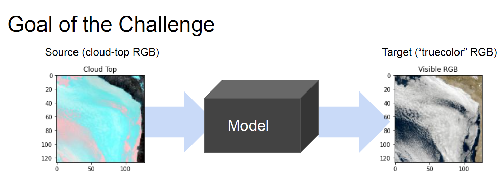

# Hackathon Climate Informatics Conference 2020

If you use our code, consider citing our paper:
```sh
@misc{harder2020,
  url = {https://arxiv.org/abs/2011.07017},
  author = {Harder, Paula and Jones, William and Lguensat, Redouane and Bouabid, Shahine and Fulton, James and Quesada-Chacón, Dánell and Marcolongo, Aris and Stefanović, Sofija and Rao, Yuhan and Manshausen, Peter and Watson-Parris, Duncan},
  title = {NightVision: Generating Nighttime Satellite Imagery from Infra-Red Observations},
  publisher = {arXiv},
  year = {2020}
}

```

This Repository contains code of participants of the Hackathon at the Climate Informatics Conference 2020 (https://ci2020.web.ox.ac.uk) and also may contain work on the same problem developed after the competition. 

Now there is a public version of the hackathon avaiable: https://competitions.codalab.org/competitions/26644#participate

## The Challenge
The task was to generate nighttime imagery from infrared observations.
<p align="center">
  
</p>

## The Results
The three most succesful solutions can be found in /solutions. The scoring was due to the structural similaroty index (SSIM).

<p align="center">
  
</p>

<p align="center">
  
</p>
