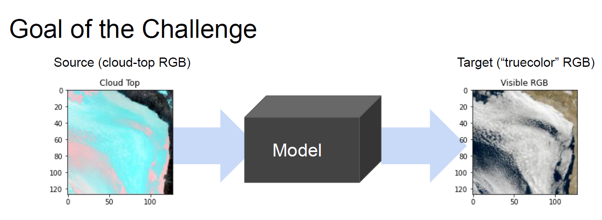

# CI Hackathon
This repo contains the solution to the data challenge (CI 2020 https://ci2020.web.ox.ac.uk, now publicly available: https://competitions.codalab.org/competitions/26644#participate) by the team unaccountable_penguins.
## The task
The task was to generate nighttime imagery from infrared observations.

  

## The approach
This approach uses the Tensoflow tutorial https://www.tensorflow.org/tutorials/generative/pix2pix, based on the pix2pix cGAN https://arxiv.org/pdf/1611.07004.pdf. The generator loss function is changed from a L1 guidance to a SSIM (structural similarity index) one.
